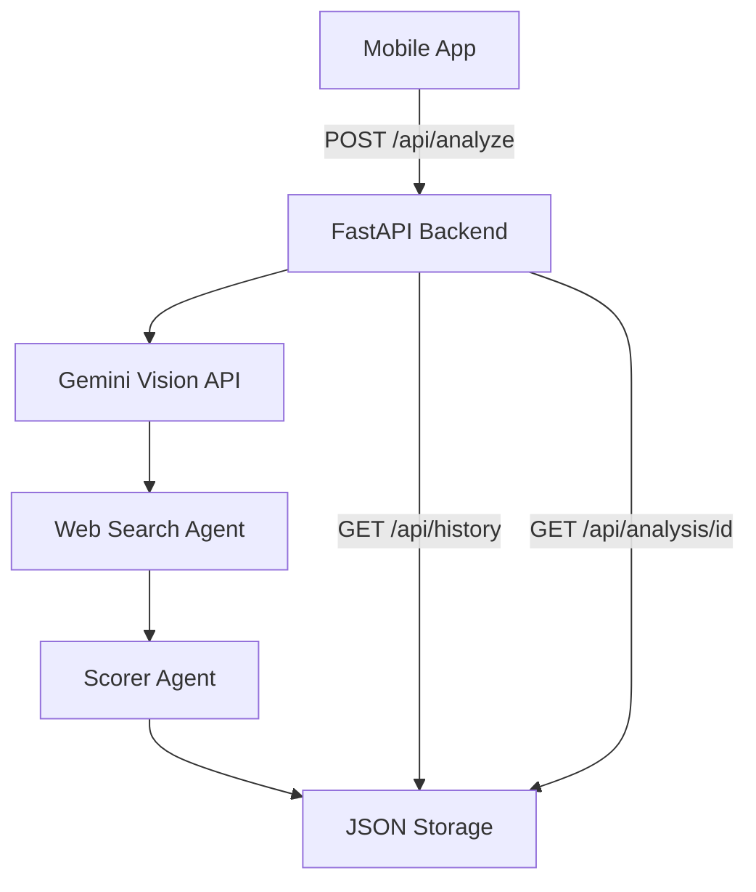
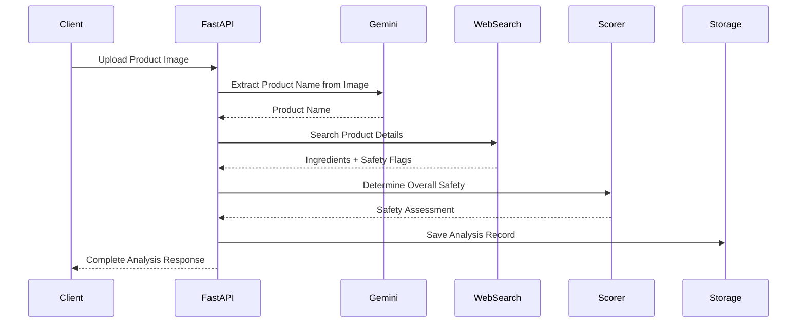

# Design Document

## Overview

The HealthScan AI Backend is a FastAPI-based microservice that orchestrates multiple AI agents to analyze product health safety from uploaded images. The system follows a pipeline architecture where each agent performs a specific task: OCR text extraction, product name parsing, ingredient research, and safety scoring. The backend provides RESTful APIs for analysis and history management while persisting data in JSON format for simplicity.

## Architecture

### High-Level Architecture



### Agent Pipeline Flow



## Components and Interfaces

### 1. FastAPI Application (main.py)

**Responsibilities:**
- Handle HTTP requests and responses
- Orchestrate agent pipeline execution
- Manage file uploads and validation
- Provide API documentation

**Key Endpoints:**
- `POST /api/analyze` - Process product image analysis
- `GET /api/history` - Retrieve analysis history
- `GET /api/analysis/{analysis_id}` - Get specific analysis

### 2. Agent System

#### Web Search Agent (agents/web_search_agent.py)
```python
from openai_agents import Agent, ModelSettings
from tools.search_tools import WebSearchTool

SEARCH_INSTRUCTIONS = """
You are a world-class research assistant specialized in finding product information.
Given a product name, search for detailed ingredient information and assess initial safety flags.
Focus on finding accurate ingredient lists from reliable sources like OpenFoodFacts.
"""

search_agent = Agent(
    name="ProductSearcher",
    instructions=SEARCH_INSTRUCTIONS,
    model="gpt-4o-mini",
    tools=[WebSearchTool(search_context_size="low")],
    model_settings=ModelSettings(tool_choice="required")
)
```

**Input:** Product name
**Output:** Product details with ingredients and initial safety flags
**Tools:** Uses WebSearchTool from OpenAI Agents SDK

#### Scorer Agent (agents/scorer_agent.py)
```python
from openai_agents import Agent, ModelSettings
from tools.scoring_tools import IngredientSafetyTool

SCORER_INSTRUCTIONS = """
You are a health and nutrition expert specialized in ingredient safety assessment.
Analyze ingredient lists and determine overall product safety based on health criteria.
Mark products as unsafe if they contain harmful ingredients like high fructose corn syrup,
artificial additives, excessive preservatives, or other health-concerning substances.
"""

scorer_agent = Agent(
    name="HealthScorer",
    instructions=SCORER_INSTRUCTIONS,
    model="gpt-4o-mini",
    tools=[IngredientSafetyTool()],
    model_settings=ModelSettings(tool_choice="required")
)
```

**Input:** List of ingredients with safety flags
**Output:** Overall safety assessment with status and message

### 3. Tool Functions

#### Search Tools (tools/search_tools.py)
```python
from openai_agents import Tool

class WebSearchTool(Tool):
    """Tool for searching product information from external APIs"""
    
    def search_by_name(self, product_name: str) -> dict:
        """Search OpenFoodFacts API for product details"""
        
    def get_product_ingredients(self, product_data: dict) -> list:
        """Extract and normalize ingredient list"""
```

#### Scoring Tools (tools/scoring_tools.py)
```python
from openai_agents import Tool

class IngredientSafetyTool(Tool):
    """Tool for assessing ingredient and product safety"""
    
    def analyze_ingredient_safety(self, ingredient_name: str) -> tuple[bool, str]:
        """Assess individual ingredient safety"""
        
    def calculate_overall_safety(self, ingredients: list) -> dict:
        """Determine overall product safety"""
```

### 4. Utility Components

#### Gemini Client (utils/gemini_client.py)
```python
class GeminiVisionClient:
    def __init__(self, api_key: str)
    def extract_product_name(self, image_bytes: bytes) -> str
```

#### Database Manager (utils/db_manager.py)
```python
class JSONDBManager:
    def __init__(self, db_path: str = "data/analyses.json")
    def save_analysis(self, analysis_id: str, analysis_data: dict)
    def get_analysis(self, analysis_id: str) -> dict
    def get_all_analyses(self) -> list
    def generate_analysis_id(self) -> str
```

## Data Models

### Analysis Record Structure
```python
from pydantic import BaseModel
from typing import List, Optional
from datetime import datetime

class Ingredient(BaseModel):
    name: str
    safe: bool
    unsafe_reason: str = ""

class Product(BaseModel):
    name: str
    brand: Optional[str] = None

class AnalysisResponse(BaseModel):
    analysis_id: str
    timestamp: datetime
    product: Product
    ingredients: List[Ingredient]
    is_safe: bool
    status: str  # "SAFE" or "UNSAFE"
    message: str

class HistoryItem(BaseModel):
    analysis_id: str
    timestamp: datetime
    product_name: str
    brand: Optional[str]
    is_safe: bool
```

### Configuration Model
```python
class Settings(BaseModel):
    openai_api_key: str
    gemini_api_key: str
    port: int = 8000
    environment: str = "development"
    cors_origins: List[str] = ["*"]
```

## MVP Simplifications

For the hackathon MVP, the system focuses on core functionality:
- Basic image upload and processing
- Simple agent pipeline execution
- JSON file storage for analysis history
- Minimal error handling (basic HTTP status codes)
- No authentication or rate limiting
- Direct API calls without retry logic

## Deployment Configuration

### Environment Variables
```bash
OPENAI_API_KEY=sk-...
GEMINI_API_KEY=...
PORT=8000
ENV=development
CORS_ORIGINS=["http://localhost:3000"]
```

### Docker Configuration
- Multi-stage build for production optimization
- Health check endpoints for container orchestration
- Volume mounts for persistent data storage

### Development Setup
```bash
pip install -r requirements.txt
cp .env.example .env
uvicorn main:app --reload --port 8000
```